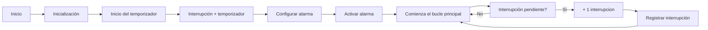

#   P2.B: Interrupciones por contador. 

## Objetivo: 
- Comprender el funcionamiento de las interrupciones. 
- Realizar las interrupciones mediante  un contador programado. 

## Materiales: 
- ESP32-S1

# Procedimiento: 
**Codigo:**

```cpp
    #include <Arduino.h>

    volatile int interruptCounter;
    int totalInterruptCounter;
    hw_timer_t * timer = NULL;
    portMUX_TYPE timerMux = portMUX_INITIALIZER_UNLOCKED;
    void IRAM_ATTR onTimer() {
        portENTER_CRITICAL_ISR(&timerMux);
        interruptCounter++;
        portEXIT_CRITICAL_ISR(&timerMux);
    }
    void setup() {
        Serial.begin(115200);
        timer = timerBegin(0, 80, true);
        timerAttachInterrupt(timer, &onTimer, true);
        timerAlarmWrite(timer, 1000000, true);
        timerAlarmEnable(timer);
    }
    void loop() {
        if (interruptCounter > 0) {
        portENTER_CRITICAL(&timerMux);
        interruptCounter--;
        portEXIT_CRITICAL(&timerMux);
        totalInterruptCounter++;

        Serial.print("An interrupt as occurred. Total number: ");
        Serial.println(totalInterruptCounter);
        }
    }
```
**Descripcion:**<br>
Primero hemos definido las variables necesarias, un contador ("interruptCounter") como  "volátil" para que pueda ser modificada dentro de la interrupción. Cuenta el número de interrupciones generadas por el temporizador. También una vatiable que se llama "totalInterruptCounter" que cuenta el número total de interrupciones ocurridas. Es necesario un puntero timer para referenciar al temporizador (NULL). Además una variable para gestionar el acceso crítico a la variable "interruptCounter· dentro de las funciones de interrupción ("timerMux").<br>
Se ha creado una función "onTimer()": cada  vez que se active el temporizador, incrementará un contador en la interrupción.<br>
En el setup() se inicializa la comunicación serial a la velocidad adecuada, se configura el temporizador para que genere las interrupciones cada segundo y se adjunta la función onTimer() a la interrupción del temporizador. Finalmente, se habilita el temporizador.<br>
En el bucle loop(), comprueba si se ha producido alguna interrupción, y si la hay, se incrementa el total de interrupciones y lo imprime por el monitor serial en un mensaje. 

**Diagrama de flujos:**

**Ejemplo de salida por  la consola serial:**
```
    An interrupt as occurred. Total number: 1
    An interrupt as occurred. Total number: 2
    An interrupt as occurred. Total number: 3
    An interrupt as occurred. Total number: 4
```
## Conclusion: 
Configura un temporizador para generar interrupciones periódicas. Cada vez que se produce una interrupción, se incrementa un contador y se imprime el número total de interrupciones en el monitor serial.
